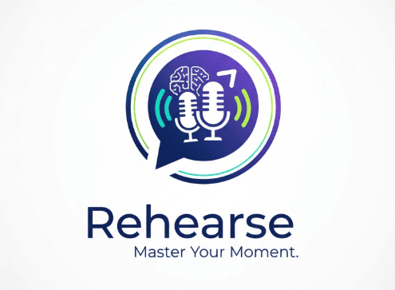

# Rehearse - AI Interview Practice Platform

<div align="center">



**Practice interviews with AI-powered personas. Get real-time feedback and improve your interview skills.**

[](LICENSE)
[](https://www.typescriptlang.org/)
[](https://reactjs.org/)
[](https://workers.cloudflare.com/)

[Frontend Demo](https://capable-fairy-fa3b2a.netlify.app) · [Admin Dashboard](http://100.68.91.200) · [Documentation](./admin/DEPLOYMENT_IP_BASED.md) · [Report Bug](https://github.com/yourusername/rehearse/issues)

</div>

---

## 📋 Table of Contents

- [About](#about)
- [Features](#features)
- [Tech Stack](#tech-stack)
- [Project Structure](#project-structure)
- [Getting Started](#getting-started)
- [Deployment](#deployment)
- [Admin Dashboard](#admin-dashboard)
- [Environment Variables](#environment-variables)
- [Contributing](#contributing)
- [License](#license)

---

## 🎯 About

Rehearse is an AI-powered interview practice platform that helps users improve their interview skills through realistic practice sessions with AI personas. The platform offers:

- **Realistic Interview Simulations** with multiple AI personas
- **Real-time Voice Conversations** using ElevenLabs
- **Intelligent Feedback** powered by Cerebras AI
- **Detailed Analytics** to track progress and improvement
- **Flexible Practice Modes** (practice or graded sessions)
- **Document-based Interviews** - Upload resumes for tailored questions

Perfect for job seekers, students, and professionals looking to sharpen their interview skills.

---

## ✨ Features

### User Features

- 🎤 **Voice-based Interviews** - Natural conversations with AI personas
- 👥 **Multiple Personas** - Practice with different interviewer types (technical, behavioral, HR)
- 📊 **Real-time Analytics** - Instant feedback on confidence, clarity, and relevance
- 📄 **Document Upload** - Upload resume for personalized questions
- ⏱️ **Flexible Durations** - Choose 15, 30, or 60-minute sessions
- 🎓 **Practice & Graded Modes** - Learn at your own pace or test yourself
- 📈 **Progress Tracking** - View historical performance and improvement trends
- 💳 **Subscription Plans** - Free trial + flexible pricing
- 🔐 **Secure Authentication** - WorkOS-powered OAuth

### Admin Features

- 👤 **User Management** - View, search, and manage users
- 📊 **Analytics Dashboard** - System stats, MRR, conversion rates
- 🎭 **Persona Management** - Create and manage AI personas
- 💰 **Revenue Tracking** - Monitor subscriptions and revenue
- 🏥 **System Health** - Monitor application health and performance
- 📋 **Activity Logs** - Track user actions and system events

---

## 🛠️ Tech Stack

### Frontend
- **Framework**: React 18 with TypeScript
- **Build Tool**: Vite
- **Styling**: Tailwind CSS
- **Routing**: React Router v6
- **State Management**: React Query (TanStack Query)
- **Icons**: Lucide React
- **Deployment**: Netlify

### Backend
- **Framework**: LiquidMetal.AI Raindrop (Cloudflare Workers)
- **Database**: SmartSQL (SQLite on Cloudflare D1)
- **AI/ML**:
  - Cerebras Cloud SDK (Question generation & feedback)
  - ElevenLabs (Voice synthesis)
- **Authentication**: WorkOS AuthKit
- **Payments**: Stripe
- **Deployment**: Cloudflare Workers

### Admin Dashboard
- **Framework**: React 18 with TypeScript
- **Build Tool**: Vite
- **Styling**: Tailwind CSS
- **Charts**: Recharts
- **Deployment**: Vultr VPS + Docker + Nginx

---

## 📁 Project Structure

```
rehearse/
├── frontend/                  # User-facing React application
│   ├── src/
│   │   ├── components/       # Reusable UI components
│   │   ├── contexts/         # React contexts (Auth, etc.)
│   │   ├── pages/           # Page components
│   │   ├── lib/             # Utilities and API client
│   │   └── hooks/           # Custom React hooks
│   └── dist/                # Production build
│
├── admin/                    # Admin dashboard
│   ├── src/
│   │   ├── components/      # Admin UI components
│   │   ├── contexts/        # Admin contexts
│   │   ├── pages/          # Admin pages
│   │   └── lib/            # Admin utilities
│   ├── Dockerfile          # Docker configuration
│   ├── nginx.conf          # Nginx configuration
│   └── DEPLOYMENT.md       # Deployment guide
│
├── shared/                  # Shared code between apps
│   ├── types/              # TypeScript type definitions
│   └── api/                # Shared API client
│
├── src/                     # Backend (Raindrop)
│   ├── rehearse-api/       # Main API service
│   ├── services/           # Business logic services
│   ├── middleware/         # Custom middleware
│   └── sql/               # Database schemas and migrations
│
├── db/                     # Database files
├── prisma/                # Prisma schema
├── scripts/               # Build and utility scripts
├── public/                # Static assets
│
└── docs/
    ├── DEPLOYMENT_GUIDE.md
    ├── WORKOS_ADMIN_SETUP.md
    └── ADMIN_IMPLEMENTATION_COMPLETE.md
```

---

## 🚀 Getting Started

### Prerequisites

- Node.js 18+ and npm
- Raindrop CLI: `npm install -g @liquidmetal-ai/raindrop-cli`
- Git

### Installation

1. **Clone the repository**
   ```bash
   git clone https://github.com/yourusername/rehearse.git
   cd rehearse
   ```

2. **Install dependencies**
   ```bash
   # Root dependencies
   npm install

   # Frontend dependencies
   cd frontend
   npm install
   cd ..

   # Admin dependencies
   cd admin
   npm install
   cd ..
   ```

3. **Set up environment variables**

   Create `.env` files based on `.env.example`:
   ```bash
   # Backend environment (via Raindrop)
   raindrop build env set WORKOS_API_KEY "your_workos_api_key"
   raindrop build env set WORKOS_CLIENT_ID "your_workos_client_id"
   raindrop build env set WORKOS_REDIRECT_URI "http://localhost:5173/auth/callback"
   raindrop build env set CEREBRAS_API_KEY "your_cerebras_api_key"
   raindrop build env set ELEVENLABS_API_KEY "your_elevenlabs_api_key"
   raindrop build env set STRIPE_SECRET_KEY "your_stripe_secret_key"
   raindrop build env set STRIPE_WEBHOOK_SECRET "your_stripe_webhook_secret"

   # Frontend .env.local
   cd frontend
   echo "VITE_API_URL=http://localhost:8787" > .env.local
   cd ..

   # Admin .env.local
   cd admin
   echo "VITE_API_URL=http://localhost:8787" > .env.local
   cd ..
   ```

4. **Build the backend**
   ```bash
   npm run build
   ```

5. **Start development servers**

   Open three terminals:

   **Terminal 1 - Backend:**
   ```bash
   raindrop build start
   # Runs on http://localhost:8787
   ```

   **Terminal 2 - Frontend:**
   ```bash
   cd frontend
   npm run dev
   # Runs on http://localhost:5173
   ```

   **Terminal 3 - Admin Dashboard:**
   ```bash
   cd admin
   npm run dev
   # Runs on http://localhost:5174
   ```

6. **Access the applications**
   - User App: http://localhost:5173
   - Admin Dashboard: http://localhost:5174
   - API Health: http://localhost:8787/health

---

## 🌐 Deployment

### Frontend (Netlify)

1. **Build the frontend**
   ```bash
   cd frontend
   npm run build
   ```

2. **Deploy to Netlify**
   ```bash
   netlify deploy --prod --dir=dist
   ```

   Or connect your GitHub repository to Netlify for automatic deployments.

### Backend (Cloudflare Workers via Raindrop)

1. **Build and deploy**
   ```bash
   npm run build
   raindrop build deploy
   ```

2. **Set production environment variables**
   ```bash
   raindrop build env set WORKOS_REDIRECT_URI "https://yourdomain.com/auth/callback"
   # Set other production env vars...
   ```

See [DEPLOYMENT_GUIDE.md](./DEPLOYMENT_GUIDE.md) for detailed deployment instructions.

### Admin Dashboard (Vultr VPS)

See [admin/DEPLOYMENT_IP_BASED.md](./admin/DEPLOYMENT_IP_BASED.md) for complete deployment guide.

**Quick summary:**
1. Push code to GitHub
2. Create Vultr VPS (Debian 12, Chicago location)
3. Clone repository from GitHub via Vultr console
4. Build and run Docker container
5. Configure Nginx reverse proxy
6. Access at http://100.68.91.200

---

## 🔐 Admin Dashboard

The admin dashboard provides comprehensive management capabilities:

- **User Management**: View, search, filter, and manage users
- **Analytics**: System stats, revenue tracking, user activity
- **Persona Management**: Create and manage AI interviewer personas
- **System Health**: Monitor application health and performance

### Accessing Admin Dashboard

**Development**: http://localhost:5174
**Production**: http://100.68.91.200

### Admin Setup

1. Sign up through the main app first (creates user account)
2. Navigate to admin dashboard
3. Authenticate with WorkOS (uses same account)

See [WORKOS_ADMIN_SETUP.md](./WORKOS_ADMIN_SETUP.md) for detailed setup instructions.

---

## 🔑 Environment Variables

### Backend (Raindrop)

| Variable | Description | Required |
|----------|-------------|----------|
| `WORKOS_API_KEY` | WorkOS API key | ✅ |
| `WORKOS_CLIENT_ID` | WorkOS client ID | ✅ |
| `WORKOS_REDIRECT_URI` | OAuth callback URL | ✅ |
| `CEREBRAS_API_KEY` | Cerebras AI API key | ✅ |
| `ELEVENLABS_API_KEY` | ElevenLabs API key | ✅ |
| `STRIPE_SECRET_KEY` | Stripe secret key | ✅ |
| `STRIPE_WEBHOOK_SECRET` | Stripe webhook secret | ✅ |
| `ADMIN_WORKOS_REDIRECT_URI` | Admin OAuth callback | ⚠️ |
| `ADMIN_FRONTEND_URL` | Admin dashboard URL | ⚠️ |

### Frontend

| Variable | Description | Default |
|----------|-------------|---------|
| `VITE_API_URL` | Backend API URL | `http://localhost:8787` |

### Admin

| Variable | Description | Default |
|----------|-------------|---------|
| `VITE_API_URL` | Backend API URL | `http://localhost:8787` |

---

## 📊 Database

The application uses **SmartSQL** (SQLite on Cloudflare D1) with the following main tables:

- `users` - User accounts and subscriptions
- `interviews` - Interview sessions
- `personas` - AI interviewer personas
- `scenarios` - Interview scenarios
- `sessions` - Active interview sessions
- `questions` - Generated interview questions
- `responses` - User responses and feedback
- `analytics` - Performance analytics

### Migrations

```bash
# Create migration
npm run create-migration

# Generate seed data
npm run seed:createSql

# Reset and seed database
npm run render-db
```

---

## 🧪 Testing

```bash
# Run tests
npm test

# Run tests in watch mode
npm run test:watch
```

---

## 🤝 Contributing

Contributions are welcome! Please follow these steps:

1. Fork the repository
2. Create a feature branch (`git checkout -b feature/AmazingFeature`)
3. Commit your changes (`git commit -m 'Add some AmazingFeature'`)
4. Push to the branch (`git push origin feature/AmazingFeature`)
5. Open a Pull Request

### Coding Standards

- Use TypeScript for all new code
- Follow the existing code style
- Add tests for new features
- Update documentation as needed

---

## 📝 Documentation

- [Deployment Guide](./DEPLOYMENT_GUIDE.md) - Full deployment instructions
- [Admin Setup](./WORKOS_ADMIN_SETUP.md) - Admin dashboard configuration
- [Admin Deployment](./admin/DEPLOYMENT.md) - Vultr VPS deployment guide
- [Implementation Details](./ADMIN_IMPLEMENTATION_COMPLETE.md) - Technical details

---

## 🐛 Known Issues

- Revenue charts in admin dashboard are placeholders (Stripe integration pending)
- System logs in admin dashboard require external logging service integration
- Persona CRUD operations have backend support but UI modals pending

---

## 🗺️ Roadmap

- [ ] Mobile app (React Native)
- [ ] Video interview practice
- [ ] Multi-language support
- [ ] Advanced analytics dashboard
- [ ] Interview recording and playback
- [ ] Custom persona creation by users
- [ ] Interview preparation resources
- [ ] Peer interview practice (connect real users)
- [ ] Company-specific interview prep
- [ ] API for third-party integrations

---

## 📄 License

This project is licensed under the MIT License - see the [LICENSE](LICENSE) file for details.

---

## 👥 Authors

- **Your Name** - *Initial work* - [YourGitHub](https://github.com/yourusername)

---

## 🙏 Acknowledgments

- [LiquidMetal.AI](https://liquidmetal.ai) - Raindrop framework
- [WorkOS](https://workos.com) - Authentication
- [Stripe](https://stripe.com) - Payment processing
- [Cerebras](https://cerebras.ai) - AI inference
- [ElevenLabs](https://elevenlabs.io) - Voice synthesis
- [Cloudflare](https://cloudflare.com) - Edge computing
- [Netlify](https://netlify.com) - Frontend hosting
- [Vultr](https://vultr.com) - VPS hosting

---

## 📞 Support

- Email: support@rehearse.ai
- Issues: [GitHub Issues](https://github.com/yourusername/rehearse/issues)
- Discussions: [GitHub Discussions](https://github.com/yourusername/rehearse/discussions)

---

## 💰 Pricing

- **Free Trial**: 3-day Pro trial for all new users
- **Basic**: Free forever (limited features)
- **Pro**: $29/month - Full access to all features
- **Enterprise**: Custom pricing - Advanced features and support

---

<div align="center">

**⭐ Star this repository if you find it helpful!**

Made with ❤️ by the Rehearse team

[Website](https://capable-fairy-fa3b2a.netlify.app) · [Twitter](https://twitter.com/rehearseai) · [LinkedIn](https://linkedin.com/company/rehearse)

</div>
